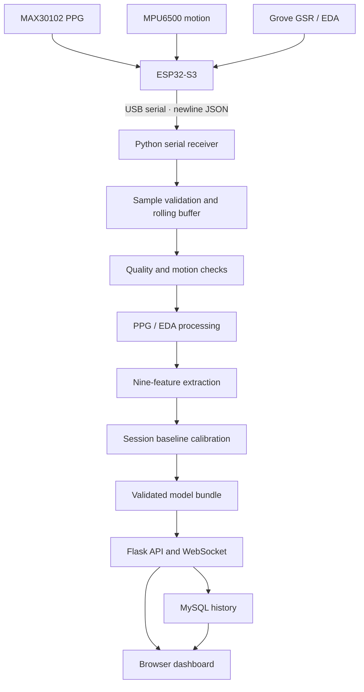

# ESP32 Stress Monitor

A research-oriented stress-monitoring prototype that combines physiological signals from an **ESP32-S3** with a Python processing backend and a browser dashboard. It collects PPG data from a MAX30102, electrodermal activity (EDA/GSR) from a Grove GSR sensor, and motion data from an MPU6500. The backend validates incoming samples, processes rolling signal windows, extracts features, and provides session/history views through a local web application.

> [!CAUTION]
> **Research prototype only — not a medical device.** The displayed labels are experimental model outputs, not a diagnosis or a direct measurement of psychological state. Hardware timing, sensor calibration, training/inference parity, and real-world performance have not been established by this repository.
>
> **Known model-artifact blocker:** the deployment metadata describes a binary `binary:logistic` XGBoost model, but inspection of the bundled `final_model.pkl` has shown regression-objective strings (`reg:squarederror`). The backend is designed to fail closed when the objective does not match. Treat live inference as **unvalidated and potentially unavailable** until the model owner verifies the artifact with the recorded runtime and resolves the mismatch. The saved artifacts are preserved; they have not been silently replaced or retrained.

## Highlights

- **Embedded acquisition:** ESP32-S3 firmware for MAX30102 PPG, MPU6500 motion, and Grove GSR/EDA sensor data.
- **Serial data protocol:** newline-delimited JSON over USB serial, with sequence and elapsed-time fields to help detect gaps.
- **Signal processing:** bounded sliding windows, signal-quality checks, motion rejection, PPG/EDA preprocessing, and nine ordered physiological features.
- **Baseline calibration:** session calibration is tracked explicitly; calibration windows are not emitted as ordinary predictions.
- **Local web application:** Flask REST endpoints, WebSocket updates, login/session handling, MySQL persistence, and a vanilla HTML/CSS/JavaScript dashboard.
- **Regression tests:** tests cover API ownership, buffering/receiver behavior, signal/inference checks, and stale frontend callbacks without requiring an ESP32 board.

## Architecture



The current design supports one physical serial receiver and one active acquisition session at a time. Model inference is subject to the artifact compatibility warning above.

## Technology stack

| Area | Technologies |
|---|---|
| Firmware | ESP32-S3, Arduino framework, MAX30102, MPU6500, Grove GSR |
| Backend | Python, Flask, Flask-Sock, pyserial |
| Signal processing / ML | NumPy, SciPy, pandas, scikit-learn, XGBoost, joblib |
| Storage | MySQL |
| Frontend | HTML, CSS, JavaScript (no frontend framework) |
| Tests | Python `unittest`, Node.js syntax checks |

## Repository structure

```text
.
├── backend/
│   ├── app.py                     # Flask routes and WebSocket stream
│   ├── buffer.py                  # Bounded rolling sample buffer
│   ├── config.py                  # Acquisition and processing settings
│   ├── db.py                      # MySQL schema and queries
│   ├── eda.py / ppg.py            # Signal processing
│   ├── feature_extraction.py      # Nine model features
│   ├── inference.py               # Artifact validation and inference
│   ├── receiver.py                # USB serial receiver
│   ├── session_manager.py         # Session lifecycle and calibration
│   ├── model/                     # Model and deployment metadata bundle
│   ├── .env.example               # Example local configuration
│   └── requirements.txt           # Pinned Python dependencies
├── firmware/
│   └── esp32_stress_monitor/
│       └── esp32_stress_monitor.ino
├── frontend/
│   ├── index.html
│   ├── login.html
│   ├── app.js
│   ├── login.js
│   └── style.css
├── tests/
├── MODEL_CARD.md                  # Intended use and model limitations
├── LICENSE
├── Start Stress Monitor.bat       # Windows launcher
├── Start Stress Monitor Backend.ps1
├── Stop Stress Monitor.bat
└── README.md
```

## Hardware

Required components:

- ESP32-S3 development board
- MAX30102 pulse oximeter / PPG module
- MPU6500 accelerometer and gyroscope module
- Grove GSR sensor
- USB cable, jumper wires, and a compatible host computer

The current firmware assigns **GPIO 8** as I²C SDA, **GPIO 9** as I²C SCL, and **GPIO 13** for the GSR analog input. These are source-code settings, not a guarantee that every board or assembled circuit uses the same wiring. Check the exact board pinout, voltage requirements, I²C address, ADC setup, and sensor connections before powering the circuit.

## Setup

The complete local application expects Python, MySQL, and an ESP32 connected over USB serial. The dependency manifest records Python **3.13.9** and pinned scientific/ML package versions; use a compatible environment for model-artifact checks.

### 1. Create a Python environment

From the repository root:

```bash
python -m venv backend/.venv
```

Activate it on Windows PowerShell:

```powershell
.\backend\.venv\Scripts\Activate.ps1
```

On macOS/Linux:

```bash
source backend/.venv/bin/activate
```

Install dependencies:

```bash
python -m pip install --upgrade pip
python -m pip install -r backend/requirements.txt
```

### 2. Configure MySQL and environment variables

Start a local MySQL server and create/use an account with permission to create and access the configured database. Copy the example environment file:

```powershell
# Windows PowerShell
Copy-Item backend/.env.example backend/.env
```

```bash
# macOS/Linux
cp backend/.env.example backend/.env
```

Edit `backend/.env` and set:

- `DB_HOST`, `DB_PORT`, `DB_USER`, `DB_PASSWORD`, `DB_NAME`
- `DASH_SECRET_KEY` to a unique random secret (at least 32 characters)
- `SERIAL_PORT` to the ESP32's serial port, such as `COM3` on Windows or `/dev/ttyUSB0` on Linux

Generate a secret with:

```bash
python -c "import secrets; print(secrets.token_urlsafe(48))"
```

Keep `DASH_HOST=127.0.0.1` for local use. Only expose the service to a network when you have deliberately configured the required security protections. Leave optional feature CSV logging disabled unless you have a documented local research need.

**Never commit `backend/.env`, real credentials, raw sensor recordings, local database dumps, virtual environments, or generated feature files.** The `.gitignore` contains protections for common local-only files; review `git status` before pushing.

### 3. Upload the firmware

1. Install Arduino IDE and ESP32 board support for your specific ESP32-S3 board.
2. Open `firmware/esp32_stress_monitor/esp32_stress_monitor.ino`.
3. Install compatible libraries providing `MAX30105.h`, `MPU6500_WE.h`, and `ArduinoJson.h`.
4. Select the correct board and USB port, then compile and upload.
5. The firmware uses **115200 baud**. Do not leave Arduino Serial Monitor connected while the Python receiver is using the same port.

### 4. Start the backend

From the repository root, with the environment activated:

```bash
cd backend
python app.py
```

The complete flow requires MySQL and the configured serial device. If startup fails on model validation, review the **Known model-artifact blocker** at the top of this README and the detailed notes in [MODEL_CARD.md](MODEL_CARD.md). Do not bypass the validation or advertise live predictions as working until the artifact owner has resolved the mismatch.

On Windows, `Start Stress Monitor.bat` and the accompanying PowerShell/stop scripts are provided as launch helpers. The backend is intended to be accessed locally at `http://127.0.0.1:5000` when startup completes successfully.

## Data processing overview

1. The receiver parses newline-delimited JSON and rejects malformed or out-of-range samples.
2. Sample sequence numbers and device elapsed times are used to identify gaps; partial windows are reset on detected discontinuities rather than filled with fabricated readings.
3. Processing uses a nominal **64 Hz** rate, **60-second** windows (3,840 samples), and **30-second** steps (1,920 samples), corresponding to 50% overlap.
4. Motion and signal-quality checks reject unsuitable windows before feature extraction.
5. The pipeline calculates `HR`, `SDNN`, `RMSSD`, `eda_mean`, `eda_std`, `eda_min`, `eda_max`, `eda_range`, and `eda_slope`.
6. Session baseline calibration is performed from accepted windows before normal inference is allowed by the pipeline.

The nominal sampling rate and EDA conversion have not been verified against assembled hardware. Firmware requests a MAX30102 rate/averaging configuration that may not match the effective rate delivered to the backend. The live session baseline is a practical approximation and is not proven equivalent to the original training preprocessing.

## API overview

Authenticated endpoints include:

| Endpoint | Purpose |
|---|---|
| `POST /api/auth/register` | Create an account |
| `POST /api/auth/login` / `POST /api/auth/logout` | Start/end a login session |
| `GET /api/auth/me` | Return the current identity |
| `POST /api/sessions/start` | Request a session and confirm calibration setup |
| `POST /api/sessions/<id>/stop` | Stop an owned session |
| `GET /api/sessions` | Read the authenticated user's session history |
| `GET /api/sessions/<id>/readings` | Readings for an owned session |
| `GET /api/sessions/current` | Current session for the authenticated user |
| `GET /health` | Basic service/sensor status |
| `WS /ws/stream` | User-scoped live status and reading events |

The exact response schema and authorization checks are implemented in `backend/app.py` and `backend/db.py`.

## Run tests

From the repository root after installing the dependencies:

```bash
python -m unittest discover -s tests -v
python -m compileall -q backend tests
node --check frontend/app.js
node --check frontend/login.js
```

The automated tests do not require a physical ESP32 or a production MySQL database; relevant API/database behavior is mocked. Passing software tests does **not** demonstrate hardware reliability, model accuracy, or clinical validity. This repository archive does not include a GitHub Actions workflow, so the commands above should be run locally unless CI is configured separately.

## Known limitations and responsible use

- The bundled classifier's serialized objective conflicts with deployment metadata; inference must be treated as blocked until verified and resolved.
- The final model was trained on the full development dataset and does not include its own independent held-out test score in this repository. Reported evaluation outputs referenced by the metadata are not included, so performance figures are not claimed here.
- The original model-training scripts, raw WESAD dataset, complete split outputs, and full provenance/licensing evidence are not included in this archive.
- Exact training-to-live preprocessing parity is unproven, particularly baseline normalization and window generation.
- GSR-to-conductance conversion, ESP32 ADC behavior, and actual sensor timing need physical calibration/measurement.
- Motion rejection may reduce the number of available windows; missing or rejected windows should not be interpreted as normal predictions.
- WESAD-derived development data does not establish performance for everyday use, different populations, devices, or stress contexts.

See [MODEL_CARD.md](MODEL_CARD.md) for the model's intended use, provenance claims, artifact details, and risk notes.

## License

This repository includes an [MIT License](LICENSE). Before publishing or redistributing, confirm that you have the rights to all source code, model artifacts, datasets, and third-party components. The raw development dataset is not included in this repository.
